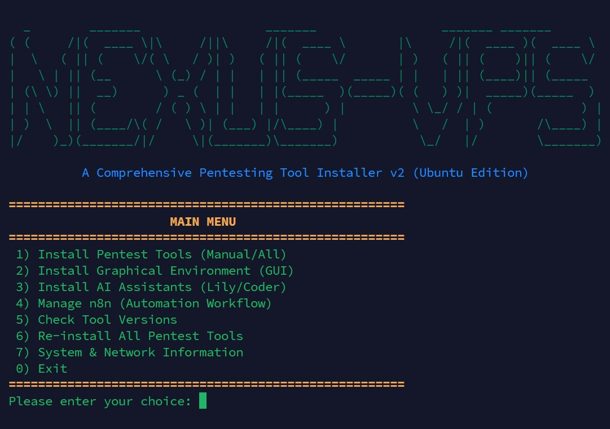

# Comprehensive Pentesting Tool Installer for Ubuntu

A powerful and interactive bash script designed to automate the installation and management of a wide range of penetration testing tools, services, a full graphical desktop environment, and a containerized AI assistant on fresh Ubuntu systems (primarily tested on Ubuntu 22.04 LTS).

This script is built for cybersecurity professionals, students, and enthusiasts who want to set up their testing environment quickly and efficiently, without the hassle of manual installations and dependency management.

---

## ☕ Support the Project

If you like this project and want to support its development, you can donate TON using the following key:

`UQBnoOaSb46CRspYXK_ha9tiD5yum-ZYUGAnhJCX5Urfffg9`

Thank you for your support! 🙏




## Features

- **Interactive Menu System**: A user-friendly, menu-driven interface to install tools individually or all at once.
- **Modular Installation**: Choose exactly which tools you need. No bloat.
- **Source & Package Installations**: Intelligently combines installations from official repositories (`apt`), `GitHub` (for the latest versions), and language managers `(RVM, Go toolchain)`.
- **Dockerized AI Assistant (Lily)**: Installs and configures "`Lily`" a cybersecurity-focused AI, inside a `Docker` container for complete system isolation and easy management.
- **GUI Installation**: Easily add a full desktop environment to your CLI-only server. Choose between the standard `GNOME` (full Ubuntu experience) or lightweight `XFCE`.
- **Automated Dependency Handling**: The script automatically installs all necessary prerequisites, including specific versions of `Ruby` (via RVM) and `Go`.
- **Verification & Maintenance**: Includes options to check tool versions and completely reinstall the toolkit.

---

## Tools & Services Included

Below is a categorized overview of the main tools bundled with this installer.

| Category | Tools |
| --- | --- |
| Web App Analysis | SQLMap, Nikto, ffuf, Wfuzz, BeEF-XSS |
| Network Scanning | Nmap, Masscan (via Nmap scripts) |
| Exploitation | Metasploit Framework |
| Password Attacks | Hydra |
| Reconnaissance | Recon-ng |
| System Services | Docker Engine, Nginx, ProxyChains |
| Development | Neovim, Go, Ruby (RVM) |
| AI Assistant | Lily (Cybersecurity LLM via Ollama) |
| Desktop Environments | GNOME (Standard), XFCE (Lightweight) |

> This is a representative list — the script is modular and can be extended to include additional tools.

---

## Prerequisites

- An `Ubuntu-based` system `(VPS or local machine)`. Primarily tested on **Ubuntu 22.04 LTS**.
- `sudo` or root privileges.
- A stable internet connection for downloading packages and source code.

---

## Installation & Usage

1. **Clone the repository**

```bash
git clone https://github.com/nexus-arm/Nexus-VPS.git
cd Nexus-VPS
```

2. **Make the script executable**

```bash
chmod +x nexus-vps.sh
```

3. **Run the script with sudo privileges**

```bash
sudo ./nexus-vps.sh
```

4. **Follow the on-screen menus**

The main menu will appear, allowing you to navigate to different sub-menus for installing pentesting tools, a GUI, or the Lily AI assistant.

---

## Key Feature Details

### Pentest Tool Installer

- Select option **1** from the main menu to access the tool installation sub-menu.
- Install tools one by one by selecting their corresponding number, or choose **Install ALL Tools** to set everything up.
- The installer blends `apt` packages, `git` clones, and language-specific installers to obtain recent, working versions.

### Lily — The Dockerized AI Assistant

- Select option **3** to install Lily.
- The script will automatically install Docker if it's not already present, create and run a dedicated ollama container, and provide options for model size (lighter vs heavier model variants).
- After the model is downloaded and set up, the script performs cleanup and creates a global `lily` command for easy terminal access:

```bash
lily "your cybersecurity question here"
```

### Graphical Environment (GUI)

- Select option **2** to install a desktop environment.
- **GNOME** — the full Ubuntu desktop (recommended for machines with adequate resources).
- **XFCE** — lightweight and resource-friendly (recommended for constrained VPS).
- After installation, **sudo reboot** to boot into the graphical login screen.

---

## Verification & Maintenance

- The script includes a menu option to **check tool versions** to verify successful installation.
- There is also an option to **reinstall all tools** if you need to rebuild the environment from scratch.

---

## Contributing

Contributions, issues, and feature requests are welcome! Please open an issue or submit a pull request on the repository.

If you add or change tools, try to keep the installer modular and document new options clearly in `nexus-vps.sh`.

---

## License

This project is licensed under the **MIT License**. See the `LICENSE` file for details.

---

*Generated README for the `nexus-vps` pentesting installer.*

